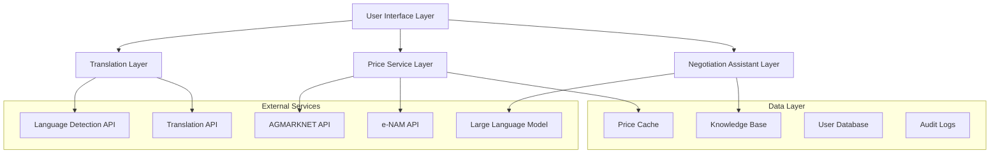

# Design Document: Mandi Facilitator

## Overview

The Mandi Facilitator is a comprehensive agentic system that bridges linguistic and financial barriers in Indian agricultural trading. The system integrates real-time dialect translation, APMC price data services, and AI-powered negotiation assistance to create a unified platform for agricultural trade facilitation.

Based on research, the system will leverage:
- **AGMARKNET/e-NAM APIs** for official APMC price data ([data.gov.in](https://data.gov.in) provides CSV/JSON access)
- **Sarvam AI or similar services** for Indian language translation (supporting 22+ scheduled languages)
- **Large Language Models** for empathetic negotiation assistance with agricultural domain knowledge

## Architecture

The system follows a microservices architecture with four core components:



## Components and Interfaces

### Translation Engine

**Purpose**: Provides real-time bidirectional translation between Indian dialects with agricultural terminology preservation.

**Key Interfaces**:
```typescript
interface TranslationEngine {
  detectLanguage(input: string): Promise<LanguageCode>
  translate(text: string, from: LanguageCode, to: LanguageCode): Promise<TranslationResult>
  translateWithContext(text: string, context: TradeContext, from: LanguageCode, to: LanguageCode): Promise<TranslationResult>
}

interface TranslationResult {
  translatedText: string
  confidence: number
  preservedTerms: string[]
  detectedContext: TradeContext
}
```

**Implementation Strategy**:
- Primary: Sarvam AI API for Indian languages (22 scheduled languages)
- Fallback: Google Translate API for broader coverage
- Agricultural terminology dictionary for context preservation
- Language detection using IndicLID or similar models

### Price Service

**Purpose**: Fetches, caches, and serves real-time APMC price data with location-based filtering.

**Key Interfaces**:
```typescript
interface PriceService {
  getCurrentPrices(location: Location, commodity?: string): Promise<PriceData[]>
  getHistoricalPrices(location: Location, commodity: string, days: number): Promise<PriceHistory>
  subscribeToUpdates(location: Location, callback: PriceUpdateCallback): Subscription
}

interface PriceData {
  commodity: string
  market: string
  location: Location
  pricePerQuintal: number
  qualityGrade: QualityGrade
  moistureContent?: number
  timestamp: Date
  source: 'AGMARKNET' | 'eNAM'
}
```

**Implementation Strategy**:
- Primary data source: AGMARKNET API via data.gov.in
- Secondary: e-NAM platform integration
- Redis caching for performance (5-minute TTL during trading hours)
- WebSocket connections for real-time updates
- Location-based filtering using postal codes/districts

### Negotiation Assistant

**Purpose**: Provides empathetic, context-aware guidance during agricultural trade negotiations.

**Key Interfaces**:
```typescript
interface NegotiationAssistant {
  startNegotiation(context: NegotiationContext): Promise<NegotiationSession>
  provideAdvice(session: NegotiationSession, query: string): Promise<NegotiationAdvice>
  suggestCounterOffer(session: NegotiationSession, currentOffer: TradeOffer): Promise<CounterOfferSuggestion>
  mediateDispute(session: NegotiationSession, dispute: DisputeContext): Promise<MediationSuggestion>
}

interface NegotiationAdvice {
  suggestion: string
  reasoning: string
  marketContext: MarketContext
  confidence: number
  empathyLevel: 'supportive' | 'neutral' | 'encouraging'
}
```

**Implementation Strategy**:
- Fine-tuned LLM with agricultural trading knowledge
- Prompt engineering for empathetic responses
- Market data integration for contextual advice
- Multi-turn conversation management
- Neutrality enforcement through system prompts

### User Interface Layer

**Purpose**: Provides accessible, multilingual interface supporting voice and text interactions.

**Key Features**:
- Progressive Web App (PWA) for mobile-first experience
- Voice input/output using Web Speech API
- Real-time translation display
- Price data visualization with charts
- Negotiation chat interface
- Offline capability for basic functions

## Data Models

### Core Data Structures

```typescript
// Trade Context
interface TradeContext {
  commodity: string
  weightInQuintals: number
  qualityGrade: QualityGrade
  moistureContent?: number
  location: Location
  timestamp: Date
}

// Quality Classification
enum QualityGrade {
  A = 'A',  // Premium quality
  B = 'B',  // Standard quality  
  C = 'C'   // Lower grade
}

// Location Information
interface Location {
  state: string
  district: string
  market: string
  pincode?: string
  coordinates?: {
    latitude: number
    longitude: number
  }
}

// User Profile
interface UserProfile {
  id: string
  preferredLanguage: LanguageCode
  location: Location
  userType: 'farmer' | 'trader' | 'commission_agent'
  tradingHistory: TradeRecord[]
}

// Negotiation Session
interface NegotiationSession {
  id: string
  participants: UserProfile[]
  tradeContext: TradeContext
  currentOffer?: TradeOffer
  conversationHistory: Message[]
  status: 'active' | 'completed' | 'disputed'
  createdAt: Date
}
```

### Database Schema

**Users Collection**:
- User profiles with language preferences
- Trading history and reputation scores
- Location and market preferences

**Price Data Collection**:
- Time-series price data from APMC sources
- Market-wise commodity pricing
- Quality grade differentials

**Translation Cache**:
- Frequently translated phrases
- Agricultural terminology mappings
- Context-aware translation pairs

**Negotiation Logs**:
- Session transcripts for improvement
- Successful negotiation patterns
- Dispute resolution outcomes

## Correctness Properties

*A property is a characteristic or behavior that should hold true across all valid executions of a system—essentially, a formal statement about what the system should do. Properties serve as the bridge between human-readable specifications and machine-verifiable correctness guarantees.*

### Property 1: Language Detection Accuracy
*For any* text input in a supported Indian dialect, the Translation_Engine should correctly identify the language or default to Hindi when detection confidence is below threshold
**Validates: Requirements 1.1, 1.2**

### Property 2: Translation Round-Trip Consistency  
*For any* text containing agricultural terminology, translating from language A to language B and back to language A should preserve the core meaning and all trade-specific context (weights, grades, moisture content)
**Validates: Requirements 1.3, 1.4, 1.5**

### Property 3: Location-Specific Price Data Retrieval
*For any* valid location and commodity request, the Price_Service should return properly organized price data (by produce type, quality grade, market) specific to that location, or provide appropriate error handling when data is unavailable
**Validates: Requirements 2.1, 2.2, 2.3**

### Property 4: Price Change Alert Triggering
*For any* significant price change above the configured threshold, the Price_Service should generate appropriate alerts to subscribed users
**Validates: Requirements 2.5**

### Property 5: Trade Context Extraction and Standardization
*For any* trade communication text, the Mandi_Facilitator should accurately extract and standardize weight (quintals), quality grade (A/B/C), and moisture content, prompting for missing information when context is incomplete
**Validates: Requirements 3.1, 3.2, 3.3, 3.5**

### Property 6: Trade Context Consistency
*For any* negotiation session, the Trade_Context should remain consistent across all translation and negotiation interactions within that session
**Validates: Requirements 3.4**

### Property 7: Market-Informed Negotiation Advice
*For any* negotiation request, the Negotiation_Assistant should provide advice that incorporates current market price data and explains market factors affecting pricing discrepancies
**Validates: Requirements 4.1, 4.3**

### Property 8: Negotiation Neutrality
*For any* negotiation session with multiple parties, the Negotiation_Assistant should provide balanced advice that doesn't systematically favor one party over another
**Validates: Requirements 4.4**

### Property 9: Compromise Solution Generation
*For any* negotiation impasse scenario, the Negotiation_Assistant should generate compromise suggestions that are grounded in current market data and reasonable for both parties
**Validates: Requirements 4.5**

### Property 10: Location-Based Market Prioritization
*For any* user location, the Mandi_Facilitator should prioritize nearby markets in price data and provide comparative pricing across regional markets when multiple options are available
**Validates: Requirements 5.1, 5.2, 5.3**

### Property 11: Location Preference Override
*For any* manually specified market location, the system should use that preference instead of auto-detected location for all subsequent price data requests
**Validates: Requirements 5.4**

### Property 12: Location Fallback Handling
*For any* scenario where location services are unavailable, the system should gracefully request manual location input from users
**Validates: Requirements 5.5**

### Property 13: Data Validation and Quality Indicators
*For any* price data retrieved from external sources, the Price_Service should validate data integrity, provide quality indicators when data is unreliable, and maintain audit logs with timestamps
**Validates: Requirements 6.1, 6.2, 6.3**

### Property 14: Translation Confidence Indicators
*For any* translation with uncertain accuracy, the Translation_Engine should provide confidence scores that accurately reflect translation quality
**Validates: Requirements 6.4**

### Property 15: User Feedback Mechanism
*For any* data inaccuracy report from users, the system should properly record and process the feedback for system improvement
**Validates: Requirements 6.5**

### Property 16: Multi-Modal Input Support
*For any* user interaction, the system should properly process both voice and text inputs and provide appropriate audio output when requested
**Validates: Requirements 7.2, 7.4**

### Property 17: Localized Error Handling
*For any* error condition, the system should display error messages in the user's preferred language with helpful guidance
**Validates: Requirements 7.3, 7.5**

### Property 18: Performance Response Times
*For any* typical translation request, the system should respond within 2 seconds, and for any price data request, within 3 seconds
**Validates: Requirements 8.1, 8.2**

### Property 19: Load-Based Function Prioritization
*For any* high system load scenario, the system should prioritize core translation and pricing functions over secondary features
**Validates: Requirements 8.4**

### Property 20: Network Resilience
*For any* network interruption, the system should gracefully handle the failure and provide offline capabilities where possible
**Validates: Requirements 8.5**

## Error Handling

The system implements comprehensive error handling across all components:

### Translation Engine Errors
- **Language Detection Failures**: Fallback to Hindi with user notification
- **Translation API Timeouts**: Cached translations or simplified responses
- **Unsupported Language Pairs**: Clear error messages with alternative suggestions

### Price Service Errors  
- **APMC API Unavailability**: Fallback to cached data with staleness indicators
- **Invalid Location Data**: User prompts for location clarification
- **Network Connectivity Issues**: Offline mode with last-known prices

### Negotiation Assistant Errors
- **LLM Service Failures**: Fallback to rule-based responses
- **Context Loss**: Session recovery from stored conversation history
- **Inappropriate Content Detection**: Content filtering with user warnings

### System-Wide Error Patterns
- **Graceful Degradation**: Core functions remain available during partial failures
- **User Communication**: All errors explained in user's preferred language
- **Logging and Monitoring**: Comprehensive error tracking for system improvement
- **Recovery Mechanisms**: Automatic retry logic with exponential backoff

## Testing Strategy

The Mandi Facilitator requires a dual testing approach combining unit tests for specific scenarios and property-based tests for comprehensive validation.

### Property-Based Testing
- **Framework**: Use fast-check (JavaScript/TypeScript) or Hypothesis (Python) for property-based testing
- **Test Configuration**: Minimum 100 iterations per property test to ensure thorough coverage
- **Test Tagging**: Each property test tagged with format: **Feature: mandi-facilitator, Property {number}: {property_text}**
- **Coverage**: All 20 correctness properties must be implemented as property-based tests

### Unit Testing Strategy
- **Translation Engine**: Test specific language pairs, agricultural terminology preservation, edge cases with malformed input
- **Price Service**: Test API integration, caching behavior, location filtering, error scenarios
- **Negotiation Assistant**: Test conversation flow, context preservation, advice quality with known scenarios
- **Integration Points**: Test component interactions, data flow between services, end-to-end scenarios

### Test Data Management
- **Synthetic Data**: Generate realistic agricultural trade scenarios for testing
- **Language Corpus**: Curated dataset of agricultural terms in multiple Indian languages
- **Price Data Mocking**: Simulated APMC responses for consistent testing
- **User Scenarios**: Representative user journeys covering different trader types

### Performance Testing
- **Load Testing**: Simulate concurrent users during peak trading hours
- **Response Time Validation**: Automated verification of 2-second translation and 3-second price data requirements
- **Stress Testing**: System behavior under resource constraints
- **Network Simulation**: Testing offline capabilities and network failure scenarios

The testing strategy ensures both functional correctness through property-based testing and practical reliability through comprehensive unit and integration testing.